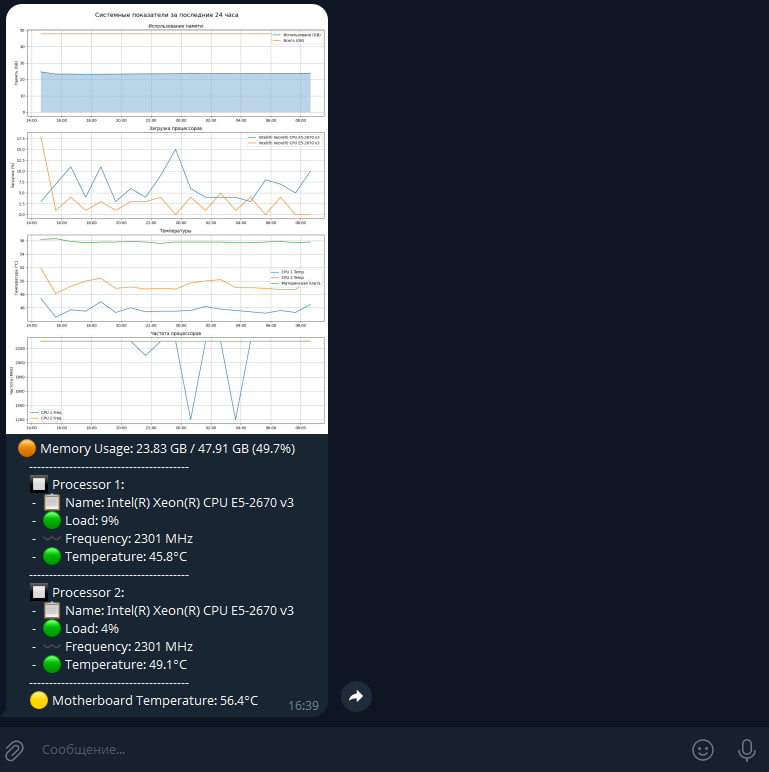
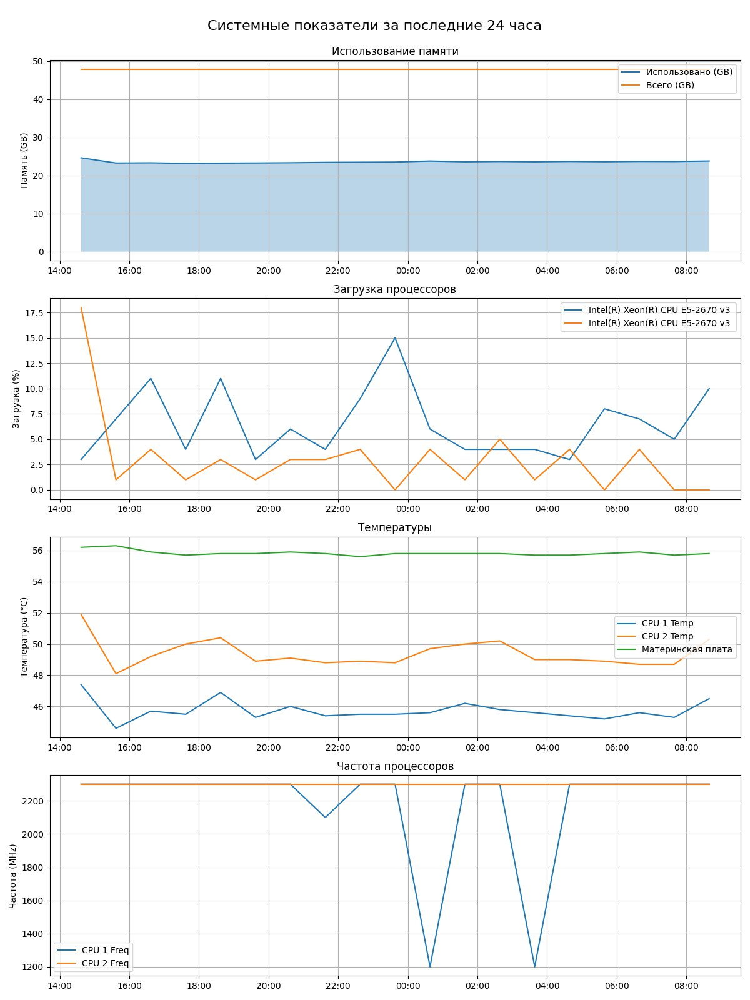

# 🚀 Server Stats Telegram Bot

A Telegram bot that periodically sends system statistics with visualizations based on data gathered from a local API. Tracks memory usage, CPU load, temperature, and frequency for two processors and motherboard. 🖥️🔥

---

## ✨ Features

* 📊 Collects system stats via a FastAPI service  
* 💾 Stores stats history in CSV  
* 📈 Generates and sends hourly graphs via Telegram  
* 🔴🟢 Visual status indicators (emojis) for load and temperature  
* 🖥️⚙️ Supports dual-processor systems

---

## 📌 Prepare to start

1. Download and run [openhardwaremonitor](https://openhardwaremonitor.org/)

2. Clone the repository:

   ```shell
   git clone https://github.com/IvanArsenev/server-stats-tg-bot.git
   cd server-stats-tg-bot
   ```

3. Create a `config.py` file with your configuration:

   ```python
   BOT_TOKEN = ''                   # Telegram bot token
   USER_ID = 0                      # Telegram user ID to send messages to
   DF_PATH = 'df_system_stats.csv'  # Path to store stats CSV
   API_HOST = '192.168.0.*'         # Host IP for API server
   API_PORT = 1111                  # Port for API server
   ```

---

## 🚀 Easy Start

Just run the provided batch script:

```bat
start.bat
```

---

## 🛠️ Manual Setup

1. Create and activate a Python virtual environment (tested with Python 3.11):

   ```shell
   python3.11 -m venv .venv
   .\.venv\Scripts\activate
   ```

2. Install dependencies:

   ```shell
   pip install pywin32==310 wmi==1.5.1 uvicorn==0.34.2 fastapi==0.115.12 psutil==7.0.0
   ```

3. Run the system info API:

   ```shell
   python .\system_info_api.py
   ```

4. In a new terminal, activate your environment again and start the bot with Docker Compose:

   ```shell
   cd .\server-stats-tg-bot
   .\.venv\Scripts\activate
   docker-compose up -d --build
   ```

---

## ⚙️ How It Works

* `system_info_api.py` runs a FastAPI server exposing endpoints to fetch memory and CPU stats using WMI and psutil.
* `bot.py` fetches these stats hourly, updates a CSV log, generates graphs with Matplotlib, and sends a photo with stats summary to the Telegram user.
* `utils.py` contains helper functions for calling the API.
* Stats include memory usage, processor loads, frequencies, and temperatures, shown with intuitive colored emoji statuses. 📉🔥

## 💬 Message preview




---

## 📝 Notes

* Requires Windows due to WMI and hardware monitoring dependencies. 🪟
* Tested on Python 3.11. 🐍
* Make sure your Telegram bot token and user ID are correctly configured.
* The bot deletes previous messages before sending new updates to keep the chat clean. 🧹

---
